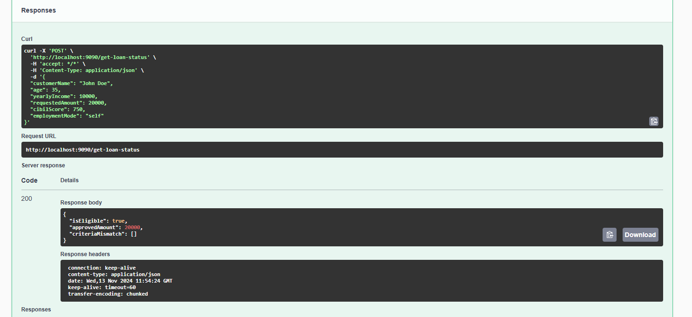
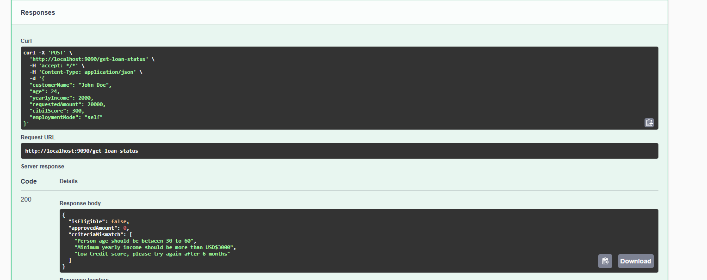

# loan-eligibility-soap-ws-client

How to Consume Soap Webservices using WebServiceTemplate and Spring Boot.

This project is a client of the SOAP api server at [spring-boot-soap-ws](https://github.com/bruce-mig/spring-boot-soap-ws)

---

### Use case (Development)

SOAP API app to evaluate loan eligibility for customers using Contract First Approach `WSDL -> Java`

#### Desired Customer inputs:
- Customer Name
- Age
- Income
- CIBIL Score
- Employment Mode


#### Response:
- isEligible for loan
- Approved Amount
- Mismatch Criteria

---

### Eligible Case



### Non Eligible Case



### WSDL file

Web Services Description Language

```xml
<wsdl:definitions xmlns:wsdl="http://schemas.xmlsoap.org/wsdl/" xmlns:sch="http://www.github.com/bruce_mig/spring_boot_soap_ws/loan_ligibility" xmlns:soap="http://schemas.xmlsoap.org/wsdl/soap/" xmlns:tns="http://www.github.com/bruce_mig/spring_boot_soap_ws/loan_ligibility" targetNamespace="http://www.github.com/bruce_mig/spring_boot_soap_ws/loan_ligibility">
    <wsdl:types>
        <xsd:schema xmlns:xsd="http://www.w3.org/2001/XMLSchema" elementFormDefault="qualified" targetNamespace="http://www.github.com/bruce_mig/spring_boot_soap_ws/loan_ligibility">
            <xsd:element name="CustomerRequest">
                <xsd:complexType>
                    <xsd:sequence>
                        <xsd:element name="customerName" type="xsd:string"/>
                        <xsd:element name="age" type="xsd:int"/>
                        <xsd:element name="yearlyIncome" type="xsd:long"/>
                        <xsd:element name="requestedAmount" type="xsd:long"/>
                        <xsd:element name="cibilScore" type="xsd:int"/>
                        <xsd:element name="employmentMode" type="xsd:string"/>
                    </xsd:sequence>
                </xsd:complexType>
            </xsd:element>
            <xsd:element name="Acknowledgement">
                <xsd:complexType>
                    <xsd:sequence>
                        <xsd:element name="isEligible" type="xsd:boolean"/>
                        <xsd:element name="approvedAmount" type="xsd:long"/>
                        <xsd:element maxOccurs="unbounded" name="CriteriaMismatch" type="xsd:string"/>
                    </xsd:sequence>
                </xsd:complexType>
            </xsd:element>
        </xsd:schema>
    </wsdl:types>
    <wsdl:message name="CustomerRequest">
        <wsdl:part element="tns:CustomerRequest" name="CustomerRequest"> </wsdl:part>
    </wsdl:message>
    <wsdl:portType name="LoanEligibilityIndicatorEndpoint">
        <wsdl:operation name="Customer">
            <wsdl:input message="tns:CustomerRequest" name="CustomerRequest"> </wsdl:input>
        </wsdl:operation>
    </wsdl:portType>
    <wsdl:binding name="LoanEligibilityIndicatorEndpointSoap11" type="tns:LoanEligibilityIndicatorEndpoint">
        <soap:binding style="document" transport="http://schemas.xmlsoap.org/soap/http"/>
        <wsdl:operation name="Customer">
            <soap:operation soapAction=""/>
            <wsdl:input name="CustomerRequest">
                <soap:body use="literal"/>
            </wsdl:input>
        </wsdl:operation>
    </wsdl:binding>
    <wsdl:service name="LoanEligibilityIndicatorEndpointService">
        <wsdl:port binding="tns:LoanEligibilityIndicatorEndpointSoap11" name="LoanEligibilityIndicatorEndpointSoap11">
            <soap:address location="http://localhost:8080/ws"/>
        </wsdl:port>
    </wsdl:service>
</wsdl:definitions>

```